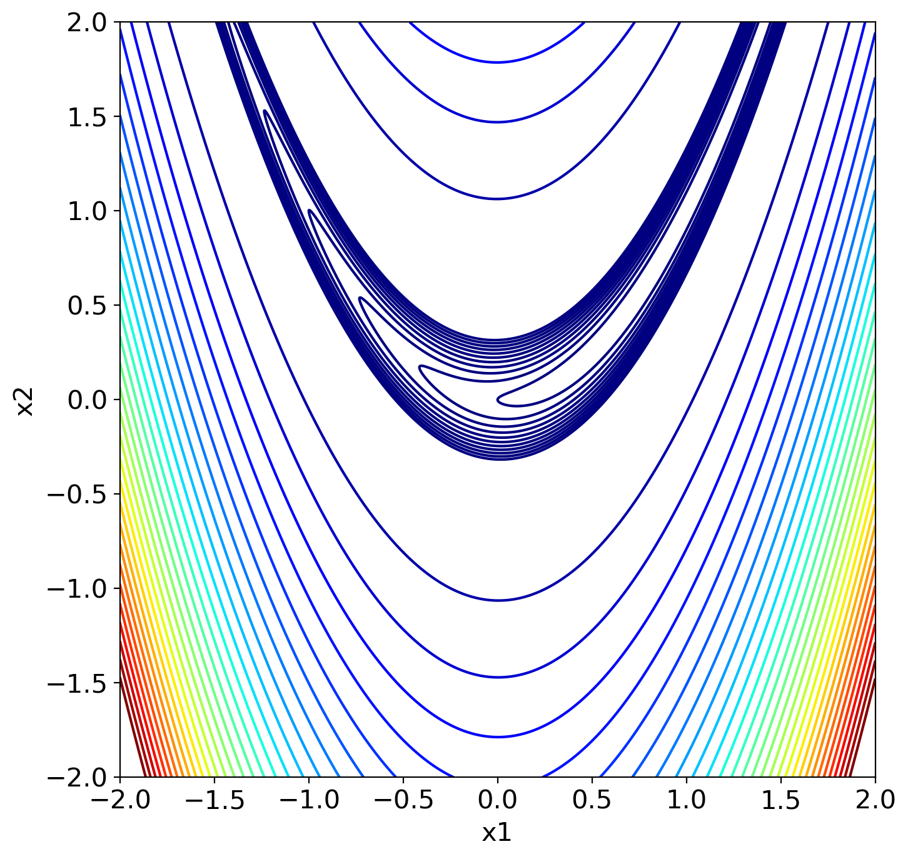
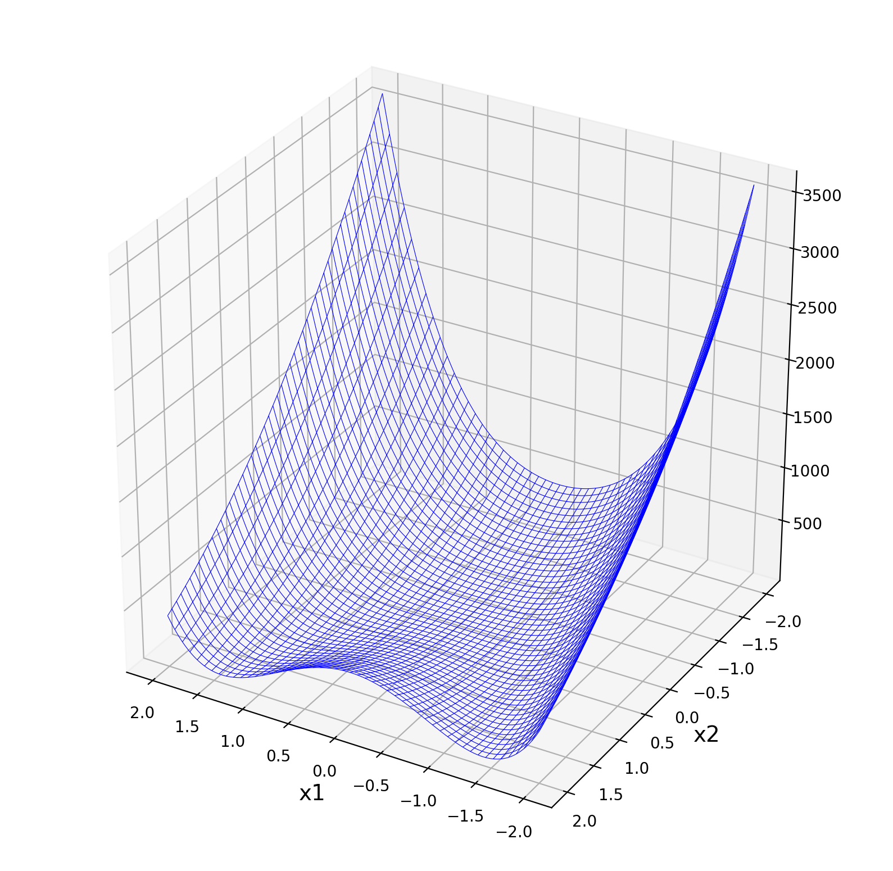
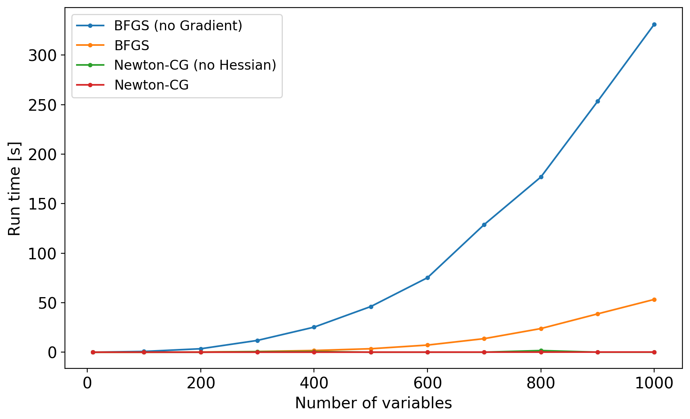

# 準ニュートン法とかのお話

今回は，$ f:\mathbb{R}^m \rightarrow \mathbb{R} $ となるような関数の**最小化**について考えていきます．

## ニュートン法とは？

- 一次微分の情報と二次微分の情報を使って，極値(最小値)を求める方法
- $f:\mathbb{R}^m \rightarrow \mathbb{R}$ が凸関数の場合，常に大域的最適解を求めることが可能

### ざっくりとした数学的な解説

1. 初期点 $ \mathbf{x}_0 = (x_{01}, \dots, x_{0m}) $ とする

2. 初期点 $ \mathbf{x}_0 $ の近傍を $ \mathbf{x}_0 + \Delta \mathbf{x} = (x_{01}+\Delta x_1,\dots, x_{0m}+\Delta x_m) $とし，$ \mathbf{x}_0 $周りの2次までのテーラー展開を考えると以下のようになる:
   $$
    f( \mathbf{x}_0 + \Delta \mathbf{x} ) = f(\mathbf{x}_0) + \sum_{i=1}^{n}\frac{\partial f(\mathbf{x}_0)}{\partial x_i}\Delta x_i + \frac{1}{2}\left( \frac{\partial}{\partial x_1}\Delta x_1 + \cdots + \frac{\partial}{\partial x_n}\Delta x_n \right)^2 f(\mathbf{x}_0) \tag{1}
   $$

3. (1)式を$ \Delta x_i $で微分すると以下のようになる:
   $$
    \frac{\partial f( \mathbf{x}_0 + \Delta \mathbf{x} )}{\partial x_i} = \frac{\partial f(\mathbf{x}_0)}{\partial x_i} + \sum_{k=1}^{m}\frac{\partial^2 f(\mathbf{x}_0)}{\partial x_i \partial x_k}\Delta x_k \tag{2}
   $$

4. 全ての $i$ について，(2)式が0となるとき，$f(\mathbf{x}_0 + \Delta \mathbf{x})$は極値を取る

5. $\mathbf{x}_0$における，$f$ の勾配ベクトルを $\nabla f_0$，ヘシアン(ヘッセ行列)を $H_0$ とすると，$\partial f( \mathbf{x}_0 + \Delta \mathbf{x} )/\partial x_i = 0$の解は次のように表せる:
   $$
    \Delta \mathbf{x} = -{H_0}^{-1}\nabla f_0
   $$
6. 次の点を $\mathbf{x}_1 = \mathbf{x}_0 - {H_0}^{-1} \nabla f_0$ に更新し，繰り返し計算を続ける

- 簡単に言ってしまえば，関数を二次近似して改善方向(と移動距離)を求めていく方法

### ニュートン法のメリット・デメリット

- メリット
  - 収束がとても早い (2次収束する)
  - 原理的に理解しやすい
- デメリット
  - ヘッセ行列を陽に求める必要がある
  - ヘッセ行列の逆行列を計算する必要がある
  - 初期点によっては収束しない

## 準ニュートン法

- ニュートン法のヘッセ行列を，2次微分を必要としない適当な近似行列 $B$ に置き換えたアルゴリズム
- $B$ をどのように定義するかで，色々なモデルが提案されている

### 代表的な準ニュートン法

- BFGS法
  - scipyに実装されている準ニュートン法
  - $k+1$ 回目の反復時点のヘッセ行列 $ H_{k+1} $ を以下のように近似:
  $$
    H_{k+1} = H_k + \frac{\Delta \mathbf{x}_k \Delta \mathbf{x}_k^\mathrm{T}}{\mathbf{y}_k^\mathrm{T} \Delta \mathbf{x}_k} - \frac{H_k \mathbf{y}_k \mathbf{y}_k^\mathrm{T} H_k^\mathrm{T}}{\mathbf{y}_k^\mathrm{T} H_k \mathbf{y}_k}
  $$

  - ここで，$\mathbf{y}_k = \nabla f(\mathbf{x}_{k+1}) - \nabla f(\mathbf{x}_k)$

  - 勾配ベクトルは陽に求められることが**望ましい**が，数値微分による近似的なものでも代用できる
  - つまり，一階微分すら陽に分からない関数に対しても適用可能
  - scipyには，この方法を発展させたL-BFGS-B法が実装されてる

- L-BFGS法
  - BFGS法を記憶制限準ニュートン法に拡張したアルゴリズム
  - 限られたメモリで非常に多くの変数を扱える
- BFGS-B法
  
  - 単純矩形制約上でのBFGS法

## Newton-CG法

- 共役勾配法を利用することで，ヘッセ行列の逆行列の計算をしなくて済むようにしたニュートン法
- ヘッセ行列 (または近似行列) があれば，極値を求めることができる
- ヘッセ行列はわからなくても，ヘシアン・ベクトル積 (ヘッセ行列と特定のベクトルの積) が分かっている場合にも適応できる
- scipyのNewton-CG法では，勾配ベクトルのみが得られている (ヘッセ行列が得られていない) 状況でも求解することが可能．

### 共役勾配法 (CG法)
- 連立１次方程式 $A\mathbf{x} = \mathbf{b}$の解 $\mathbf{x}$ を，$A$の逆行列を用いずに数値的に求める方法
- この $A$ をヘッセ行列 $H$ に，ベクトル $\mathbf{b}$ を勾配ベクトル $\nabla f$ に置き換えることで，ニュートン法における解の更新を計算することができる.

## Pythonでの実装

- ニュートン法も準ニュートン法もscipyに実装されてる
- 準ニュートン法を実装する上で，勾配ベクトルが得られていることがどれだけ嬉しいかを知りたい
- ヘッセ行列も求められて，ニュートン法が実装できたらどれだけ嬉しいかを知りたい

### 最小化の例に使う関数

- 最適化アルゴリズムのベンチマークとして，よく使われるRosenbrock関数を例題とする
- $N$ 変数のRosenbrock関数は以下のように定義される:
  $$
    f(\mathbf{x}) = \sum_{i=1}^{N-1}100(x_{i+1}-{x_i}^2)^2 + (1-x_i)^2
  $$
  
- $x_i = 1\quad \forall i$ のとき，$f(\mathbf{x})=0$ で最小値

- Rosenbrock関数の概形:

### 最適化実行時間の比較

- 変数の次元数を変えながら，実行時間の推移を確認してみる
- 今回試すアルゴリズムは次の2つ
  1. BFGS法 (準ニュートン法)
      - ヘッセ行列(の逆行列)を近似的な行列に置き換えたニュートン法
      - 勾配ベクトルが得られていることが望ましい
  2. Newton-CG法 (ニュートン法 + 共役勾配法)
      - ニュートン法に共役勾配法の考え方を組合せたアルゴリズム
      - 勾配ベクトルは必須
      - ヘッセ行列，またはヘシアン・ベクトル積が求められていることが望ましい

|              | BFGS法         | Newton-CG法    |
| ------------ | -------------- | -------------- |
| 勾配ベクトル | あると望ましい | 必須           |
| ヘッセ行列   | 不要           | あると望ましい |

- BFGS法で勾配ベクトルを与える場合と与えない場合，Newton-CG法でヘッセ行列を与える場合と与えない場合の計4パターンを比較する

#### 結果

- BFGS法では，勾配ベクトルの有無で実行時間に大きな差がある
- ただ，勾配ベクトルが得られているなら，BFGS法よりもNewton-CG法を使ったほうが良さそう
- 一方で，Newton-CG法において，ヘッセ行列の有無はそこまで計算速度に大きな影響は与えていない

### 結論
- BFGS法で時間がかかったら，勾配ベクトルを求めてNewton-CG法を実装することを考えてみたら良さそう
- 勾配ベクトルを計算する+実装する手間分の時間短縮効果は得られそう
- ちなみに，ScipyのデフォルトのメソッドはBFGS法

## 参考文献
- https://ja.wikipedia.org/wiki/BFGS%E6%B3%95
- https://ja.wikipedia.org/wiki/%E3%83%8B%E3%83%A5%E3%83%BC%E3%83%88%E3%83%B3%E6%B3%95
- https://ja.wikipedia.org/wiki/%E5%85%B1%E5%BD%B9%E5%8B%BE%E9%85%8D%E6%B3%95
- http://blog.unnono.net/2011/04/newton-cg.html
- https://docs.scipy.org/doc/scipy/reference/tutorial/optimize.html