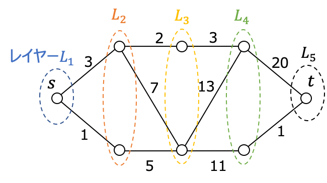
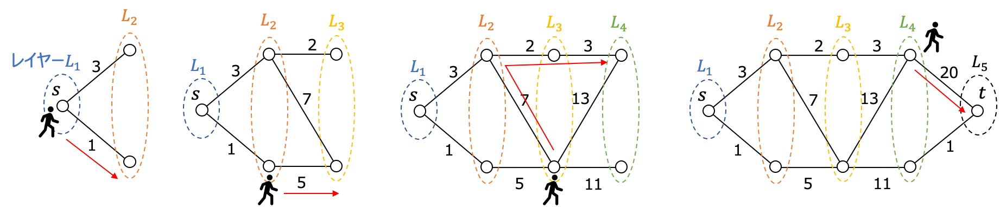
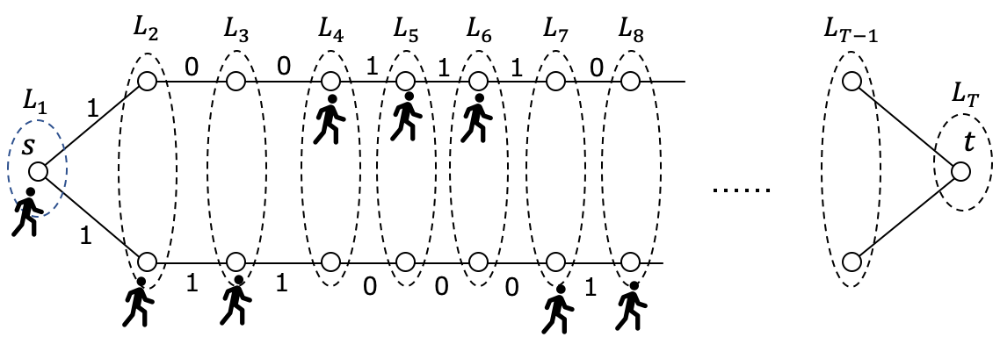

# オンライン最適化のお話

## そもそもオンライン最適化とは？
- 入力データが徐々に与えられる状況での最適化問題
- どのような戦略 (オンラインアルゴリズム) を取れば **競合比** (後述) を小さくすることが出来るか？ということを考える分野
- 有名なオンライン最適化の例
  - スキーレンタル問題
  - Canadian Traveller Problem (CTP)
  - $k$-サーバ問題
  - リストアクセス問題 ...
- 施設配置問題などの，入力データが最初からすべて得られている問題はオフライン最適化と呼ばれる

## 競合比 (Competitive Ratio)
- オンラインアルゴリズムの性能を評価する指標
- 以下の式で表される (元の問題が最小化の場合)
$$
x = 入力\\
OPT(x) = 入力 x が最初からすべて既知の場合 (オフライン) の最適値\\
A(x) = 入力 x に対してオンラインアルゴリズムを実行した場合の目的関数値\\
\mathrm{Competitive\, Ratio} = \max_{x}\frac{OPT(x)}{A(x)}
$$
- 一番都合の悪い入力が与えられたとき，オンラインアルゴリズムを実行した結果が，オフラインの最適値の何倍悪くなるか？　ということを表す
- 競合比が小さいほど，良いオンラインアルゴリズムであると言うことが出来る

## スキーレンタル問題
- 一番有名かつ一番簡単なオンライン最適化問題
### 状況設定
- これからスキーを始めるが、今後スキーに何回行くかはわからない．
- スキー板は購入すると5万円，レンタルすると1回1万円
- 買ったスキー板はずっと使い続けることができる
- **どのような戦略を取ればよいのだろうか？**

### 具体的な戦略について考えてみる
#### 戦略1
- ずっとレンタルをし続ける！
- このとき，1000回スキーに行ったら1000万円かかる
- 初回に購入していれば，5万円で済んだ
- このとき戦略1は，オフラインの最適行動より $1000 / 5 = 200$ 倍悪くなる
- これを戦略1にとって最も不利な状況を考慮して考えると，競合比は$\infty$となる

#### 戦略2
- 2回目にスキーに行くときに購入する
- この戦略にとって最悪の状況は，スキーに2回しか行かなかったとき
- このとき，戦略2では $1 + 5 = 6$万円かかるが，2回ともレンタルしていれば2万円で済ませれた
- 競合比は$6 /2 = 3$となる

#### 戦略3
- 5回目にスキーに行くときに購入する
- 結局スキーに$i (\le 4)$回しか行かなかった場合
  - 戦略3で使うのは$i$万円
  - オフラインでの最適行動でも $i$万円
- スキーに5回以上行った場合
  - 戦略3で使うのは $4 +5=9$万円
  - オフラインでの最適行動では，5万円 (一番最初に購入する)
- 競合比は$9/5=1.8$となる
- ちなみに，/この問題において戦略3よりも優れたアルゴリズムは存在しない (結構簡単に証明できる)

## Canadian Travelling Problem
- 別名 : SHORTEST PATHS WITHOUT A MAP
- ネットワークにおいて，初めは各エッジの通過時間がわからない状態から，時間経過するごとにどんどん情報が開示されていくという状況での最短経路 (最良戦略) 問題
- カナダは雪がよく降るため，どの道がどれくらい通過に時間がかかるか，その道に行ってみないと分からないため，この名前が付いたらしい

### 状況設定
- この問題では次のような層別ネットワークを考える

- ネットワーク上の各ノードはレイヤー $L_{i}$ に属しており，$L_{i} \cap L_{j} = \empty, \forall i, j (i\ne j)$
- 各レイヤーに含まれるノードの数は最大でも2つ
- $L_i$ と $L_{i+1}$の間には1本以上のエッジが存在する($\forall i$)
- $L_i$ と$L_{i+1}$ を繋ぐすべてのエッジの長さは，$L_i$に含まれるいずれかのノードに到着すると明らかになる ($\forall i$)
- 例 : (ちなみに，この移動方法は最適なオンラインアルゴリズム)

### Canadian Travelling Problemにおける最適なオンラインアルゴリズム
0. スタートノードを $s$，ゴールノードを $t$ とする
1. プレイヤーがいるノードを $v_\mathrm{now}$ ，$v_\mathrm{now}$ が存在するレイヤーを $L_i$ とする
2. $L_{i+1}$ のノードのうち，$v_\mathrm{now}$との距離が短いノードを $v_{1}$，距離が長いノードを $v_{2}$ とする．
3. $s$ と $v_{2}$ の距離が $s$ と $v_{1}$ の距離の半分未満であれば，$v_\mathrm{now}$ から $v_2$ へ最短経路で移動する．そうでなければ， $v_1$へ最短経路で移動する
4. プレイヤーのいるノードとレイヤーを更新して，1.に戻る．

- このオンラインアルゴリズムの競合比は9となり，この問題における最適な戦略であることが知られている．
- このオンラインアルゴリズムにおいて，最悪の入力データとなるネットワークは以下のようなもの

## まとめ
- 普通の最適化とは少し違い，どういう行動のルールを取れば最悪の場合をマシに出来るかということを考える分野
- 戦略の評価 (競合比) ですら結構考えるのが大変

## 感想
- いわゆる定式化をどんなふうにするか？みたいな学問分野ではなく，ちょっと自分の研究分野とは毛色が違う (ゲーム理論とかに近いかもしれない)
- 結構，数式をこね回す分野なので，拡張モデルがどんどん生まれたりはしない分野かもしれない
- 問題自体が数学的に複雑になりやすい傾向があるので，深く勉強するのは大変そう (未だ証明されていない〇〇予想とかが結構存在してる)
- とりあえず，勉強してみたのでまとめてみたけど，ちょっと違うかなぁ感がある

## 参考文献
- https://www.al.ics.saitama-u.ac.jp/horiyama/research/online/list_access.pdf
  - リストアクセス問題や乱択アルゴリズムについて，かなり分りやすく解説している

- C. H. Papadimitriou and M. Yannakakis (1989) : SHORTEST PATHS WITHOUT A MAP, *Automata, Languages and Programming. ICALP 1989. Lecture Notes in Computer Science*, vol 372