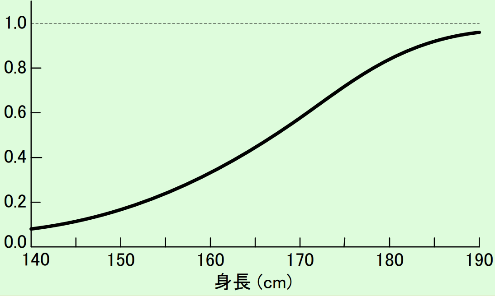

# ファジィ数理計画法 (曖昧な数理最適化) のお話

## イントロ
- 次のような問題1を考える
  1. ある工場では，2種類の製品P，Qを生産している
  2. 製品Pを1トン生産すると，**だいたい3万円** の変動費 (材料費) がかかる
  3. 製品Qを1トン生産すると，**だいたい4万円** の変動費がかかる
  4. 1日あたり，**だいたい250万円ぐらい**まで変動費として調達できる
  5. P，Qの1トン当たりの粗利益は，**だいたい5万円**，**だいたい6万円**である
  6. このとき，粗利益を最大にするには，PとQを何トンずつ作ればいいだろうか

- このような太線部のような曖昧さを含む最適化問題を考える．
  - ファジィ数理計画法では，2. 3.のような係数にかかっている曖昧さを「不明確さ」，4.のような制約にかかっている曖昧さを「漠然性」と呼ぶ

## 簡単に復習するファジィ理論
- 曖昧な集合を数学的に定義したものを「ファジィ集合」という
  - 「身長が175cm以上の人の集合」→ 普通の集合 (クリスプ集合)
  - 「背が高い人の集合」→ファジィ集合
    - 170cmの人がこの集合に含まれるかどうかは，集合の定義が曖昧なのでよくわからない

- ある身長 $x$ cmの人が「背が高い人の集合」にどれだけ含まれているかを表す関数 $\mu(x)$ を用意する
  - $\mu(x) = 1$ なら，背が高い人の集合に完全に属している
  - $\mu(x) = 0$ なら，背が高い人の集合に完全に属していない
  - この関数 $\mu(x)$ を背が高い人の集合の**メンバーシップ関数**という

## ファジィ数理計画法の定式化
- イントロの問題1を定式化すると次のようになる．
  $$
  \mathrm{maximize} \quad \tilde{5} x_1 + \tilde{6} x_2\\
  \mathrm{subject\:to} \quad \tilde{3} x_1 + \tilde{4} x_2 \lesssim 250\\
  \quad \quad x_1, x_2 \ge 0
  $$

- $\tilde{a}$ は「だいたい $a$ 」に対応するファジィ集合
  - メンバーシップ関数は次の三角関数とする場合が多い
    $$
    \mu_\tilde{a}(x)= \left\{ \begin{array}{ll}
    0 \quad &x < a - \alpha\\
    (\alpha + x - a)/\alpha \quad &a - \alpha \le x < a\\
    (\beta + a - x)/\beta \quad &a \le x < a + \beta\\
    0 \quad &a + \beta < x\\
    \end{array}
    \right.
    $$
    
    
- $\lesssim b$ は「だいたい $b$ 以下」に対応するファジィ集合
  - メンバーシップ関数は次の折れ線関数とする場合が多い
    $$
    \mu_{\lesssim b}(x)= \left\{ \begin{array}{ll}
    1 \quad &x \le b\\
    (\gamma + b - x)/\gamma \quad &b \le x < b + \gamma\\
    0 \quad &b + \gamma < x\\
    \end{array}
    \right.
    $$
    
    
    
##「解釈」の導入
- 実際に問題を解くには，上述の定式化のままでは不可能
- ファジィ数理計画問題を通常の数理最適化へ変換する
  - この操作を「解釈」と呼ぶ
  - 解釈は一般に無数に存在している

### 解釈その1「満足水準最適化モデル」
- 「目的関数値が $z$ 以上となる」 and 「ファジィ制約 (制約式) を満たす」ことの確率 (必然性測度) が $c$ 以上であるという条件のもとで，$z$ を最大化するような $x_1, x_2$を求める問題
- $\tilde{3}, \tilde{6}$ は$\alpha=\beta=1$，$\tilde{4}, \tilde{5}$は$\alpha=\beta=2$ とすると，$c=0.7$と与えると，次の線形計画問題になる
  $$
  \mathrm{maximize} \quad 3.6 x_1 + 5.3 x_2\\
  \mathrm{subject\:to} \quad 3.7 x_1 + 5.4 x_2 \le 265\\
  \quad \quad x_1, x_2 \ge 0
  $$

### 解釈その2 「様相性最適化モデル」
- 目的関数値が $z$ 以上であるという条件のもとで，ファジィ制約 (制約式) を満たす確率 (必然性測度) を最大化する問題

- $\tilde{3}, \tilde{6}$ は$\alpha=\beta=1$，$\tilde{4}, \tilde{5}$は$\alpha=\beta=2$ とすると，次の非線形計画問題となる
  $$
  \mathrm{maximize} \quad h\\
  \mathrm{subject\:to} \quad (5-2h)x_1 + (6-h)x_2 \ge 300\\
  \quad \quad \quad (3+h)x_1 + (4+2h)x_2 \le 300 - 50h\\
  \quad \quad x_1, x_2 \ge 0
  $$

- (ここらへんの変形は参考文献に明記されてなかったので，ちょっと不明です...)

- (詳しく書いてある本を借りれたら加筆するかもです)

## ファジィ数理計画法の利点と欠点
#### 利点
- 制約や目標の柔軟性，及び可能性測度や必然性測度を用いることによる可能性追求やロバスト性に関する要求を取り扱える
- 問題に意思決定者の好みを反映することができる

#### 欠点
- 通常の数理計画問題と比較して，求解は困難であり，計算に時間を要する
- 通常の数理計画問題の最適解で感度分析や事後分析を行い，問題が無ければ曖昧さをそこまで考慮する必要がない

## ファジィ数理計画問題の応用モデル・拡張モデル
- 多目的ファジィ数理計画問題
  - 複数の目的関数それぞれに対して，ファジィ目標という目標値を設定
  - すべての目的関数がファジィ目標を達成する確率が最大となるように変数を決定

- ファジィランダム計画問題
  - ファジィランダム変数を目的関数や制約式の係数に持つ最適化問題
  - ファジィランダム変数とは，「確率0.3で背が高い，確率0.7で背が低い」のように得られる結果が曖昧である確率的現象を数学的に表現したもの

- どの拡張モデルもメンバーシップ関数を線形に設定することで，それなりに解ける形に帰着させることができるっぽい

### 参考文献
[1] ファジィ数理計画法の現状と課題, https://www.orsj.or.jp/~archive/pdf/sym/S33_001.pdf
[2] 不確実状況下における多目的計画問題に対する意思決定手法, http://www.orsj.or.jp/archive2/or62-3/or62_3_141.pdf

